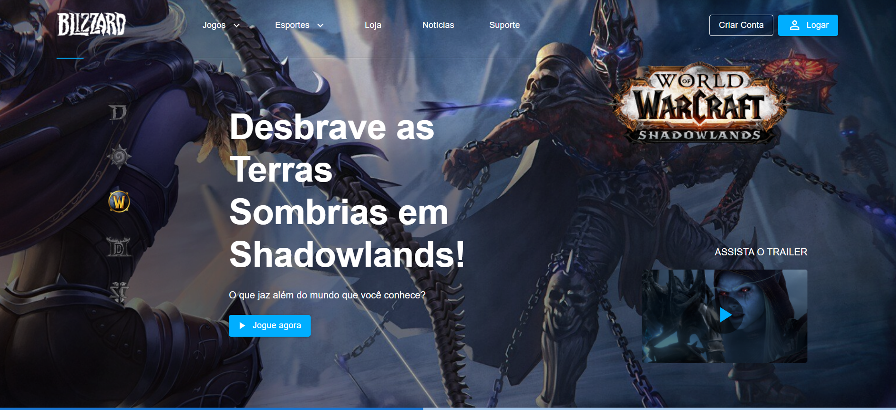

<h1 align="center">
  
</h1>

  

  

## 💻 Projeto

Esse projeto é uma landing page da empresa **Blizzard**, ela é composta por um menu de navegação, um banner hero com as informações dos principais jogos da empresa(Diablo, HearthStone e World of Warcraft), a listagem dos jogos exclusivos e um rodapé com informações do download do app battle.net.

Para facilitar a codificação do projeto foi usado um protótipo do figma como base, o autor do layout é o design [**Gilberto Prado**](https://www.linkedin.com/in/gilberto-insanydesign/), [clique aqui](https://www.brchallenges.com/desafio/blizzard) para saber mais detalhes do desafio.

## Descrição

O objetivo deste desafio é criar uma landing page que apresente os principais jogos da empresa Blizzard, conforme detalhado na página do desafio no site BRChallenges. Utilizarei as tecnologias listadas abaixo para garantir que todas as funcionalidades e requisitos propostos pelo desafio sejam contemplados.

## 🎨 Tecnologias utilizadas
-  HTML5: Para a estrutura e layout da interface do jogo.
-  CSS3: Para estilizar e tornar o jogo visualmente atraente com animações e transições.
-  JavaScript: Para adicionar funcionalidade e lógica ao jogo.
-  [React.js](https://pt-br.reactjs.org/): Para criar uma experiência de usuário responsiva e interativa.
-  [Material-UI](https://mui.com/material-ui/): Biblioteca de componentes React utilizada para implementar o design com base no Material Design da Google, proporcionando uma UI consistente e moderna.
-  [Saas](https://sass-lang.com/): Utilizado para escrever estilos CSS de forma mais eficiente e organizada, aproveitando recursos como variáveis e aninhamento.
-  [Typescript](https://www.typescriptlang.org/): Adicionado para adicionar tipagem estática opcional ao JavaScript, aumentando a robustez e a escalabilidade do código.
-  [Axios](https://axios-http.com/):  Cliente HTTP baseado em Promise utilizado para fazer requisições HTTP de forma simplificada e eficiente para a conexão com a API.

## 📝 Requisitos do desafio

### Nível Fácil

- [x] Criar as seções: **Menu**, **Banner hero**, **Footer**.

- [x]  O texto e o ícone do botão “Baixar jogo” devem ser alterados conforme o sistema operacional do usuário que estiver acessando a página. ( [material de apoio](https://developer.mozilla.org/en-US/docs/Web/API/Navigator/userAgent))

- [x]  Aplicar efeito de *hover* nas opções do menu de navegação.

- [x]  Aplicar responsividade para as seguintes resoluções: [x] 1920px, [x] 1440px, [x] 768px e [x] 375px.

### Nível Médio
### 

- [x]  Todos os requisitos do nivel fácil.

- [x]  Criar as seções: **Menu**, **Banner hero**, **Jogos Exclusivo**, **Footer**.

- [x]  Buscar a lista de jogos via api. ([acessar endpoint](https://api-brchallenges.vercel.app/api/blizzard/games))

- [x]  Aplicar efeito de hover nas imagens dos jogos da seção **Jogos Exclusivos**.

- [x]  Alterar as informações da seção **Banner Hero** ao selecionar uma opção no menu lateral. Os jogos disponíveis são **Diablo**, **HearthStone** e **World of Warcraft**.

### Nível Difícil

- [x]  Todos os requisitos do nivel fácil e médio.

- [x]  Ao clicar no botão **Logar** do menu de navegação, deverá ser exibido o modal de login.

- [x]  Criar componente de *dropdown* para as opções **Jogos** e **Esportes** do menu de navegação.

- [x]  Deverá ser executado um *gif* do jogo quando ocorrer o evento de *hover* na capa do trailer

## 👥 Autores

<table>
 <tr>
 <td alinhar="centro">
 
 </td>
 <td>
 <strong>Anthony Marin</strong> (Sub-Dev) - <a href="https://github.com/Sub-Dev">Perfil no GitHub</a>
 </td>
 </tr>
</table>

## 💬 Obrigado
Obrigado ao [**BRChallenges**](https://www.brchallenges.com/) pelo desafio envolvente que inspirou este projeto e ao [**Gilberto Prado**](https://www.linkedin.com/in/gilberto-insanydesign/) pelo design base Agradecimentos especiais à comunidade de código aberto pelos recursos e ferramentas inestimáveis ​​que tornaram este projeto possível.

## 🌐 Links
- Live Demo: [Veja o Projeto aqui](https://sub-dev.github.io/blizzard-br-challenges/)
- Link do desafio: [Desafio BRChallenges](https://www.brchallenges.com/desafio/blizzard)
- Repositório: [Repositório no GitHub](https://github.com/Sub-Dev/blizzard-br-challenges)
